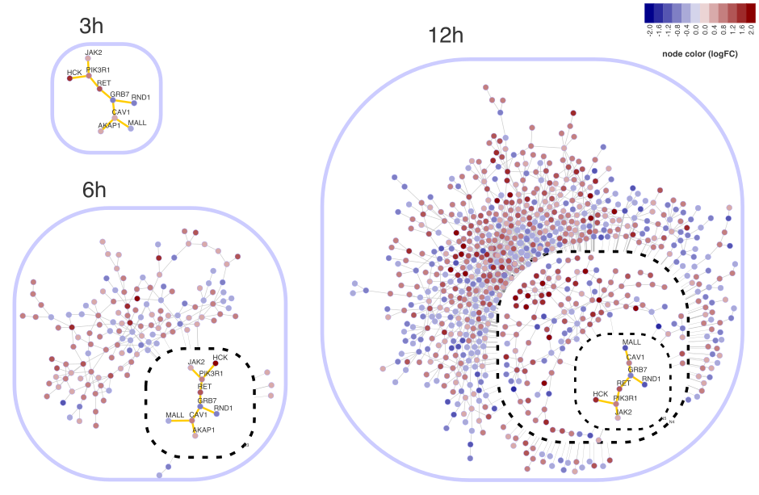

# Overview

*RedeR* is an R-based package combined with a Java application for network analysis and visualization. The design of the software is depicted in **Figure \@ref(fig:fig1)**. *RedeR* is designed to deal with three key challenges in network analysis. Firstly, biological networks are modular and hierarchical, so network visualization needs to take advantage of such structural features. Secondly, network analysis relies on statistical methods, many of which are already available in resources like _CRAN_ or _Bioconductor_. Thirdly, in larger networks user input is needed to focus the view of the network on the biologically relevant parts, rather than relying on an automatic layout function.

```{r fig1, echo=FALSE, fig.cap="Schematic representation of RedeR calls. Complex graphs with many attributes can be transferred from-and-to R using *addGraph()* and *getGraph()* functions.", out.width = '80%'}
knitr::include_graphics("fig1.png", dpi=300)
```

# Quick start

```{r label='Load packages', eval=TRUE, message=FALSE}
#--- Load required packages
library("RedeR")
library("igraph")
``` 

## Initializing the interface

The RedeR/R package sets all details to initialize the R-to-Java interface. Next, the `RedPort()` constructor will create the `rdp` object, which will be used in all methods calling the RedeR/Java application.

```{r label='Set the R-to-Java interface', eval=TRUE}
#--- Set the R-to-Java interface
rdp <- RedPort()
``` 

Note that `r BiocStyle::pkg_ver("RedeR")` is designed to run on Java>=11 (see [system requirements](#system-requirements)). Next, the `calld()` function will use the `rdp` object to launch the *RedeR* application, initializing the R-to-Java interface:

```{r label='Initialize the R-to-Java interface', eval=FALSE}
#--- Initialize the R-to-Java interface
calld(rdp)
``` 

## Displaying graphs

The `addGraph()` method displays *igraph* graphs in the *RedeR* application. The following snippet will display the `g1` graph in *RedeR*, using the `layout_with_kk()` function to set the network layout (**Figure \@ref(fig:fig2)**):

```{r label='Add a graph', eval=TRUE}
#--- Add a graph
g1 <- graph.lattice(c(3,3,3))
addGraph(rdp, g=g1, layout=layout_with_kk(g1))
``` 

```{r fig2, echo=FALSE, fig.cap="A toy example generated by the *addGraph()* function.", out.width = '60%'}

```

<br class="small">

In the reverse process, graphs are transferred from the application to _R_ using the `getGraph()` method:

```{r label='Get a graph', eval=FALSE}
#--- Get a graph
g2 <- getGraph(rdp)
summary(g2)
# IGRAPH f22cf52 UN-- 125 300 -- 
# + attr: zoom (g/n), name (v/c), coordX (v/n), coordY (v/n)
``` 

```{r label='Reset application (1)', eval=TRUE}
#--- Reset the application:
resetd(rdp)
``` 

## Working with containers

The `addGraph()` method is also used to nest graphs into containers when setting `isNested = TRUE`. Next, the graphs `g1` and `g2` are nested into containers and then displayed in the *RedeR* application.

```{r label='Generate two scale-free graphs', eval=TRUE}
#--- Generate two scale-free graphs
g1 <- sample_pa(7)
g2 <- sample_pa(5)

#--- Set names to graph vertices
V(g1)$name <- paste("m",1:7,sep="")
V(g2)$name <- paste("n",1:5,sep="")

#--- Nest graphs into containers
addGraph(rdp, g=g1, isNested=TRUE, gcoord=c(30,30), gscale=50)
addGraph(rdp, g=g2, isNested=TRUE, gcoord=c(70,70), gscale=50)
``` 

```{r fig3, echo=FALSE, fig.cap="Nested graphs in *RedeR* using the *addGraph()* function.", out.width = '70%'}
knitr::include_graphics("fig3.png")
```

<br class="small">

In this case, `g1` and `g2` are nested into containers *N1* and *N2*, respectively (**Figure \@ref(fig:fig3)**). Each subgraph will retain the network structure, allowing access to individual nodes and edges in subsequent jobs. For example, the following snippet selects all nodes in container *N2* and then retrieves the corresponding subgraph.

```{r label='Get a subgraph', eval=FALSE}
#--- Select nodes within a container 
selectNodes(rdp, nodes="N2")

#--- Get selected nodes
getGraph(rdp, status="selected")
# IGRAPH 36b1f75 UN-- 5 4 -- 
# + attr: zoom (g/n), name (v/c), coordX (v/n), coordY (v/n)
# + edges from 36b1f75 (vertex names):
# [1] n1--n2 n1--n3 n1--n4 n4--n5
``` 

```{r label='Reset application (2)', eval=TRUE}
#--- Reset the application:
resetd(rdp)
``` 

## Interactive layout

The following snippet generates a scale-free graph using igraph's `sample_pa()` function and then displays the network in *RedeR*.

```{r label='Generate a larger scale-free graph', eval=TRUE}
#--- Generate a larger scale-free graph
g1 <- sample_pa(300, directed=FALSE)

#--- Set names to igraph vertices
V(g1)$name <- paste0("V",1:vcount(g1))

#--- Check attributes in the 'g1' graph
summary(g1)
``` 

```{r label='Send the g1 graph to RedeR', eval=TRUE}
#--- Send the 'g1' graph to RedeR
addGraph(rdp, g=g1, gzoom=50)
``` 

Next, the `relax()` function starts *RedeR*'s interactive force-directed layout algorithm, which will arrange the network as in **Figure \@ref(fig:fig4)A**. The layout algorithm has 9 parameters (`p1` to `p9`), set either in the `relax()` function or in the interactive application. These parameters control the layout algorithm by adjusting the relaxing process to the hierarchical levels of the network.

```{r label='Run the interactive layout', eval=TRUE}
#--- Run RedeR's interactive layout
relax(rdp, p1=5, p2=150, p3=5, p4=100, p5=10)
``` 

```{r fig4, echo=FALSE, fig.cap="Graph layouts set by *RedeR*'s interactive force-directed algorithm. A) A scale-free graph generated by igraph's *sample_pa()* function. B,C) Examples of flat and nested networks available in the *RedeR* application.", out.width = '100%'}
knitr::include_graphics("fig4.png", dpi=600)
```

```{r label='Reset application (3)', eval=TRUE}
#--- Reset the application:
resetd(rdp)
``` 

<br class="small">

# Command-line attributes

*RedeR* attributes can be set either using the graphical user interface or the command-line interface. When using command-line attributes, these must follow `r BiocStyle::CRANpkg("igraph")` syntax rules and valid *RedeR*'s attribute names. Graph attributes are set directly on a graph using *igraph* shortcuts, while node and edge attributes are set using *igraph*'s `V()` and `E()` functions, respectivelly. For example:

```{r label='Set new attributes', eval=TRUE}
#--- Set a new graph attribute in 'g1'
g1$bgColor <- 'grey90'

#--- Set new node attributes in 'g1'
V(g1)$nodeColor <- "skyblue"
V(g1)$nodeSize <- 50

#--- Set new edge attributes in 'g1'
E(g1)$edgeColor <- "skyblue"
E(g1)$edgeWidth <- 10
``` 

```{r label='Check new attributes', eval=TRUE}
#--- Check the new attributes in 'g1'
summary(g1)
``` 

<br class="small">

Tables \@ref(tab:tab1), \@ref(tab:tab2), and \@ref(tab:tab3) list all command-line attributes available for the current version (`r BiocStyle::pkg_ver("RedeR")`), including usage examples.

<br class="small">

```{r table1, eval=TRUE, echo=FALSE}
attribs <- attributes(rdp)
attribs$GraphAttr$Usage <- gsub("$","\\$",attribs$GraphAttr$Usage, fixed=TRUE)
colnames(attribs$GraphAttr)[1] <- "RedeR attribute"
colnames(attribs$GraphAttr)[4] <- "Usage example"
knitr::kable(attribs$GraphAttr, format="html", valign = 't',linesep='', label="tab1", 
             table.attr = "style='width:100%;'",
             caption="**Graph attributes**. 
             Examples show how to set *RedeR*'s graph attributes using *igraph* shortcuts.")
``` 

<br class="small">

```{r table2, eval=TRUE, echo=FALSE}
attribs <- attributes(rdp)
attribs$VertexAttr$Usage <- gsub("$","\\$",attribs$VertexAttr$Usage, fixed=TRUE)
colnames(attribs$VertexAttr)[1] <- "RedeR attribute"
colnames(attribs$VertexAttr)[4] <- "Usage example"
knitr::kable(attribs$VertexAttr, format="html", valign = 't',linesep='', label="tab2", 
             table.attr = "style='width:100%;'",
             caption="**Node attributes**. 
             Examples show how to set *RedeR*'s node attributes using *igraph* shortcuts.")
``` 

<br class="small">

```{r table3, eval=TRUE, echo=FALSE}
attribs <- attributes(rdp)
attribs$EdgeAttr$Usage <- gsub("$","\\$",attribs$EdgeAttr$Usage, fixed=TRUE)
colnames(attribs$EdgeAttr)[1] <- "RedeR attribute"
colnames(attribs$EdgeAttr)[4] <- "Usage example"
knitr::kable(attribs$EdgeAttr, format="html", valign = 't',linesep='', label="tab3", 
             table.attr = "style='width:100%;'",
             caption="**Edge attributes**. 
             Examples show how to set *RedeR*'s edge attributes using *igraph* shortcuts.")
``` 

<br>

*RedeR* provides two wrapper functions to add fixed values to *igraph* graphs. The `att.addv()` function adds a new attribute with a fixed value to all nodes or selected nodes, while `att.adde()` function adds a new attribute with a fixed value to all edges. These functions will require that the vertices are named.

```{r label='Make sure vertices are named', eval=TRUE}
#--- Make sure vertices are named!
V(g1)$name[1:5]
```

```{r label='Using att.addv and att.adde wrapper functions', eval=TRUE}
#--- Add 'nodeFontSize' attribute from a fixed value
g1 <-  att.addv(g1, to = "nodeFontSize", value = 20)

#--- Same as above, but applied only to three nodes
g1 <- att.addv(g1, to = "nodeFontSize", value = 70, 
              filter = list("name" = V(g1)$name[1:3]))

#--- Add 'edgeType' attribute from a fixed value
g1 <-  att.adde(g1, to = "edgeType", value = "DOTTED")
```

```{r label='Check new attributes ', eval=TRUE}
#--- Check the new attributes added to 'g1'
summary(g1)
``` 

<br>

Alternatively, *RedeR*'s attributes can be set using the `att.mapv()`, `att.setv()` amd `att.sete()` wrapper functions. The `att.mapv()` will map variables from a data frame to *igraph* vertices, while `att.setv()` and `att.sete()` will transform these variables into valid attribute types. Next, to demonstrate these functions, load an *igraph* graph and a `data.frame` object with compatible identifiers.

```{r label='Load an igraph graph and a data frame', eval=TRUE}
#--- Load an igraph graph and a data frame with compatible identifiers
data(ER.deg)
g2 <- ER.deg$ceg # an igraph graph with named nodes
df <- ER.deg$dat # a data frame

#--- Check attributes already available in the 'g2' graph
summary(g2)

#--- Check colnames in the 'df' data frame
colnames(df)
``` 

``` {r label='Using att.mapv wrapper function', eval=TRUE}
#--- Map 'df' to 'g2' using the att.mapv() function
#Note: 'refcol = 0' indicates that 'df' rownames will be used as mapping IDs
g2 <- att.mapv(g=g2, dat=df, refcol=0)

#--- Check the new attributes mapped to 'g2'
summary(g2)
``` 

Note that new names were included in the `g2` graph, but these names are not valid *RedeR*'s attributes yet. Next, the `att.setv()` amd `att.sete()` functions are used to transform different data types into valid attributes.

```{r label='Using att.setv and att.sete wrapper functions', eval=TRUE}
# Set 'nodeAlias' from 'Symbol'
g2 <- att.setv(g2, from="Symbol", to="nodeAlias")

# Set 'nodeColor' from 'logFC.t3'
g2 <- att.setv(g2, from="logFC.t3", to="nodeColor", breaks=seq(-2,2,0.4), pal=2)

# Set 'nodeSize' from 'ERbdist'
g2 <- att.setv(g2, from="ERbdist", to="nodeSize", nquant=10, xlim=c(20,100,1))

# Set 'nodeFontSize' from 'ERbdist'
g2 <- att.setv(g2, from="ERbdist", to="nodeFontSize", nquant=10, xlim=c(1,50,1))

# Set 'edgeWidth' from 'weight'
g2 <- att.sete(g2, from="weight", to="edgeWidth", nquant=5, xlim=c(1,10,1))

#--- Check the new attributes set in 'g2'
summary(g2)
```


# Workflow examples

This section provides some practical examples of how users might integrate its own pre-processed data into a graph visualization workflow. Please refer to [Castro et al. (2016)](https://doi.org/10.1186/gb-2012-13-4-r29) and [Cardoso et al. (2021)](https://doi.org/10.1093/bioinformatics/btab819) for more details about the biological background and experimental design of each example.

## Subgraphs

Start the *RedeR* application (*i.e.* run the `calld()` function), and then load the `ER.limma` and `hs.inter` datasets. The `ER.limma` is a data frame with results from a time-course differential expression analysis, listing differentially expressed (DE) genes from estrogen-treated MCF-7 cells for 0, 3, 6, and 12 hours (contrasts: t3-t0, t6-t0, and t12-t0). The `hs.inter` is an *igraph* graph derived from the Human Protein Reference Database (HPRD, release 9; https://www.hprd.org/). The next snippets will show a step-by-step preparation of three nested subgraphs to display in the *RedeR* application.

```{r label='Workflow 1: Load required packages', eval=TRUE, message=FALSE}
#--- Load required packages
library("RedeR")
library("igraph")
``` 

```{r label='Workflow 1: Initialize the RedeR application', eval=TRUE}
#--- If not running, initialize the ReadeR application
# rdp <- RedPort()
# calld(rdp)
resetd(rdp)
``` 

```{r label='Workflow 1: Load a dataframe and an interactome', eval=TRUE}
#--- Load a dataframe and an interactome
data(ER.limma)
data(hs.inter)
``` 

Extract a subgraph from the `hs.inter` graph and set its attributes using the `att.setv()` function. This subgraph will include DE genes called in the t3-t0 contrast. Note that some genes are not listed in the `hs.inter`, and that's okay.

```{r label='Workflow 1: Extract a subgraph and set attributes', eval=TRUE}
#-- Extract a subgraph from the hs.inter graph
gt3  <- subg(g=hs.inter, dat=ER.limma[ER.limma$degenes.t3!=0,], refcol=1)
#-- Set attributes
gt3  <- att.setv(g=gt3, from="Symbol", to="nodeAlias")
gt3  <- att.setv(g=gt3, from="logFC.t3", to="nodeColor", breaks=seq(-2,2,0.4), pal=2)
``` 

Extract another subgraph from the `hs.inter` graph, for DE genes in the t6-t0 contrast:

```{r label='Workflow 1: Extract another subgraph and set attributes', eval=TRUE}
#--- Extract another subgraph from the hs.inter graph
gt6  <- subg(g=hs.inter, dat=ER.limma[ER.limma$degenes.t6!=0,], refcol=1)
#--- Set attributes
gt6  <- att.setv(g=gt6, from="Symbol", to="nodeAlias")
gt6  <- att.setv(g=gt6, from="logFC.t6", to="nodeColor", breaks=seq(-2,2,0.4), pal=2)
``` 

Extract another subgraph from the `hs.inter` graph, for DE genes in the t12-t0 contrast:

```{r label='=Workflow 1: Extract another subgraph and set attributes', eval=TRUE}
#--- Extract another subgraph from the hs.inter graph
gt12 <- subg(g=hs.inter, dat=ER.limma[ER.limma$degenes.t12!=0,], refcol=1)
#--- Set attributes
gt12 <- att.setv(g=gt12, from="Symbol", to="nodeAlias")
gt12 <- att.setv(g=gt12, from="logFC.t12", to="nodeColor", breaks=seq(-2,2,0.4), pal=2)
``` 

```{r label='=Workflow 1: Customize subgraph names', eval=TRUE}
#--- Customize subgraph names
gt3$nestAlias <- "3h"
gt6$nestAlias <- "6h"
gt12$nestAlias <- "12h"
``` 

Now use the `addGraph()` function to send the subgraphs to the *RedeR* application, nesting into containers. This should start building the nested network depicted in **Figure \@ref(fig:fig5)**. The `addGraph()` function will return the container IDs, `N1` to `N5`, which will be used to identify graph parents.

```{r label='Workflow 1: Send subgraphs to the RedeR application', eval=TRUE}
#--- Send nested subgraphs to the RedeR application
N1 <- addGraph(rdp, gt3, gcoord=c(10,25), gscale=20, isNested=TRUE, theme='tm1', gzoom=30)
N2 <- addGraph(rdp, gt6, gcoord=c(20,70), gscale=50, isNested=TRUE, theme='tm1', gzoom=30)
N3 <- addGraph(rdp, gt12, gcoord=c(70,55), gscale=80, isNested=TRUE, theme='tm1', gzoom=30)
``` 

... and use the `nestNodes()` function to indicate overlapping genes in the time series:

```{r label='Workflow 1: Nest sub-subgraphs', eval=TRUE}
#--- Nest sub-subgraphs
N4 <- nestNodes(rdp, nodes=V(gt3)$name, parent=N2, theme='tm2')
N5 <- nestNodes(rdp, nodes=V(gt6)$name, parent=N3, theme='tm2')
nestNodes(rdp, nodes=V(gt3)$name, parent=N5, theme='tm3')
``` 

To simplify the graph, the `mergeOutEdges()` function can be used to assign edges to containers:

```{r label='Workflow 1: Assign edges to containers', eval=TRUE}
#--- Assign edges to containers
mergeOutEdges(rdp, nlevels=2)
``` 

...then telax the network:

```{r label='Workflow 1: Relax the network', eval=TRUE}
relax(rdp, p1=100, p2=100, p3=5, p4=150, p5=5, p8=10, p9=20)
``` 

...and add a color legend:

```{r label='Workflow 1: Add a color legend', eval=TRUE}
scl <- gt3$legNodeColor$scale
leg <- gt3$legNodeColor$legend 
addLegend.color(rdp, colvec=scl, labvec=leg, title="Node color (logFC)")
``` 

Next, the `selectNodes()` function will zoom-in on the *RET* gene at different time points:

```{r label='Workflow 1: Select a gene', eval=TRUE}
selectNodes(rdp,"RET")
#repeat this line to see RET in all instances
``` 

```{r fig5, echo=FALSE, fig.cap="Nested subnetworks. This graph shows genes differentially expressed in estrogen-treated MCF-7 cells at 3, 6 and 12 h (relative to 0 h). The insets correspond to the overlap between consecutive time points. Adapted from Castro *et al.* (2012, https://doi.org/10.1186/gb-2012-13-4-r29).", out.width = '70%'}

```

## Nested networks

This example will show a step-by-step preparation of a hierarchical network to display in the *RedeR* application. Please, load the `ER.deg` dataset and then get the `dat` and `ceg` objects. The `dat` object is a data frame listing DE genes with log2 fold change statistics (logFC), while the `ceg` object is an *igraph* graph with a co-expression gene network.

```{r label='Workflow 2: Load required packages', eval=TRUE, message=FALSE}
#--- Load required packages
library("RedeR")
library("igraph")
``` 

```{r label='Workflow 2: Initialize the RedeR application', eval=TRUE}
#--- If not running, initialize the ReadeR application
# rdp <- RedPort()
# calld(rdp)
resetd(rdp)
``` 

```{r label='Workflow 2: Load a dataframe and an igraph graph', eval=TRUE}
#--- Load a dataframe and an igraph graph
data(ER.deg)
dat <- ER.deg$dat
ceg <- ER.deg$ceg
``` 

Next, the `att.mapv()` function is used to map the `dat` data frame to the `ceg` co-expression network:

```{r label='Workflow 2: Map the dataframe to the igraph graph', eval=TRUE}
#--- Map the dataframe to the igraph graph
ceg <- att.mapv(ceg, dat=dat, refcol=1)
``` 

The `att.setv()` function is then used to set valid *RedeR* attributes in the `ceg` graph: `Symbol` will be mapped to `nodeAlias`, `logFC.t3` will be mapped to `nodeColor`, and `ERbdist` will be mapped to `nodeSize`.

```{r label='Workflow 2: Set RedeR attributes', eval=TRUE}
#--- Set RedeR attributes
ceg <- att.setv(ceg, from="Symbol", to="nodeAlias")
ceg <- att.setv(ceg, from="logFC.t3", to="nodeColor", breaks=seq(-2,2,0.4), pal=2)	
ceg <- att.setv(ceg, from="ERbdist", to="nodeSize", nquant=10, isrev=TRUE, xlim=c(5,40,1))
``` 

Then the `ceg` graph is displayed in the *RedeR* application:

```{r label='Workflow 2: Send the ceg graph RedeR', eval=TRUE}
#--- Send the ceg graph RedeR
addGraph(rdp, ceg)
``` 

Next, the `hclust()` function is used for an unsupervised hierarchical cluster analysis on the `ceg` adjacency matrix:

```{r label='Workflow 2: Hierarchical clustering on the adjacency matrix', eval=TRUE}
#--- Hierarchical clustering on the adjacency matrix
hc <- hclust(dist(get.adjacency(ceg, attr="weight")))
``` 

...and the `nesthc()` function is used to superimpose the corresponding dendrogram onto the network:

```{r label='Workflow 2: Map the hclust object onto the network', eval=TRUE}
#--- Map the hclust object onto the network
nesthc(rdp, hc, cutlevel=3, nmemb=5, cex=0.3, labels=V(ceg)$nodeAlias)
``` 

```{r fig6, echo=FALSE, fig.cap="Hierarchical networks. This dendrogram is superimposed onto the network depicted in **Figure 7**. Adapted from Castro *et al.* (2012, https://doi.org/10.1186/gb-2012-13-4-r29).", out.width = '80%'}
knitr::include_graphics("fig6.png")
```

At this point nested subgraphs should appear in the *RedeR* application mapped to the dendrogram depicted in **Figure \@ref(fig:fig6)**. Next, the `mergeOutEdges()` function is used to assign edges to containers, simplifying the graph presented in **Figure \@ref(fig:fig7)**.

```{r label='Workflow 2: Assign edges to containers', eval=TRUE}
#--- Assign edges to containers
mergeOutEdges(rdp, nlevels=2)
``` 

...then relax the network:

```{r label='Workflow 2: Relax the network', eval=TRUE}
relax(rdp,100,100,100,100,5)
``` 

...and add the legends:

```{r label='Workflow 2: Add color legend', eval=TRUE}
scl <- ceg$legNodeColor$scale
leg <- ceg$legNodeColor$legend
addLegend.color(rdp, colvec=scl, labvec=leg, title="Diff. Gene Expression (logFC)")
``` 

```{r label='Workflow 2: Add node size legend', eval=TRUE}
scl <- ceg$legNodeSize$scale
leg <- ceg$legNodeSize$legend
addLegend.size(rdp, sizevec=scl, labvec=leg, title="TFBS Distance (kb)")
``` 

```{r fig7, echo=FALSE, fig.cap="Hierarchical networks. This graph is obtained by superimposing a dendrogram onto a network. Adapted from Castro *et al.* (2012, https://doi.org/10.1186/gb-2012-13-4-r29).", out.width = '70%'}
knitr::include_graphics("fig7.png")
```

## *Tree-and-leaf* diagrams

The `r BiocStyle::Biocpkg("TreeAndLeaf")` package combines tree and force-directed layout algorithms for drawing binary trees, aiming to improve the visualization of dendrogram leaves. *RedeR* is used to display *tree-and-leaf* diagrams. Next we will transform an `hclust` object into a `tree-and-leaf` object, and then display **Figure \@ref(fig:fig8)** in the *RedeR* application. Please refer to the `r BiocStyle::Biocpkg("TreeAndLeaf")` package's documentation for additional details and examples.

```{r label='Workflow 3: Load TreeAndLeaf', eval=FALSE}
#--- Load required packages
library("RedeR")
library("igraph")
library("TreeAndLeaf")
``` 

```{r label='Workflow 3: Initialize the RedeR application', eval=FALSE}
#--- If not running, initialize the ReadeR application
# rdp <- RedPort()
# calld(rdp)
resetd(rdp)
``` 

```{r label='Workflow 2: hierarchical clustering', eval=FALSE}
#-- Generate an 'hclust' object from the 'iris' dataset
hc_iris <- hclust(dist(iris[,-5]))
```

```{r label='Workflow 3: Create a tree-and-leaf object', eval=FALSE}
#-- Convert the 'hclust' object into a 'tree-and-leaf' object
tal <- treeAndLeaf(hc_iris)

#--- Map 'iris' variables to the tree-and-leaf graph
#Note: 'refcol = 0' indicates that 'iris' rownames will be used as mapping IDs
tal <- att.mapv(g = tal, dat = iris, refcol = 0)

#--- Set node attributes using the 'att.setv' wrapper function
cols <- c("#80b1d3","#fb8072","#8dd3c7")
tal <- att.setv(tal, from="Species", to="nodeColor", cols=cols)
tal <- att.setv(tal, from="Species", to="nodeLineColor", cols=cols)	
tal <- att.setv(tal, from="Petal.Width", to="nodeSize", nquant=6, xlim=c(5,50,1))

#--- Set other attributes using igraph shortcuts
V(tal)$nodeAlias <- ""
E(tal)$edgeColor <- "grey70"
``` 

```{r label='Workflow 3: Send the tal graph to RedeR', eval=FALSE}
#--- Send the tree-and-leaf graph to RedeR
addGraph(rdp, tal)

#--- Call 'relax' to fine-tune the leaf nodes
relax(rdp, p1=10, p2=100, p3=1, p4=120, p5=1, p6=5, p7=20)

#--- Add legends
addLegend.color(rdp, tal, title="Species")
addLegend.size(rdp, tal, title="PetalWidth", position="bottomright")

#--- Suggestion: anchor inner nodes to adjust the final layout
#selectNodes(rdp, V(tal)$name[!V(tal)$isLeaf], anchor=TRUE)
``` 

```{r fig8, echo=FALSE, fig.cap="A tree-and-leaf diagram. This graph is obtained by transforming an *hclust* object into a *tree-and-leaf* object.", out.width = '70%'}
knitr::include_graphics("fig8.png")
```


# Citation

If you use *RedeR*, please cite:

* Castro MA, Wang X, Fletcher MN, Meyer KB, Markowetz F (2012). “RedeR: R/Bioconductor package for representing modular structures, nested networks and multiple levels of hierarchical associations.” *Genome Biology*, 13(4), R29. [Doi:10.1186/gb-2012-13-4-r29](https://doi.org/10.1186/gb-2012-13-4-r29).


# Other useful links

* Cardoso MA, Rizzardi LEA, Kume LW, Groeneveld C, Trefflich S, Morais DAA, Dalmolin RJS, Ponder BAJ, Meyer KB, Castro MAA. "TreeAndLeaf: an R/Bioconductor package for graphs and trees with focus on the leaves." *Bioinformatics*, 38(5):1463-1464, 2022. https://bioconductor.org/packages/TreeAndLeaf/

* Csardi G and Nepusz T. “The Igraph Software Package for Complex Network Research.” *InterJournal*, ComplexSystems:1695, 2006. https://igraph.org


# System requirements{#system-requirements}

`r BiocStyle::pkg_ver("RedeR")` will need the Java Runtime Environment (JRE) version 11 or higher (Java >=11). The package will also run on earlier Java versions (Java >=8), but with reduced functionality. In order to check the Java on your system, please use the `RedPort()` function with `checkJava=TRUE`, for example:

```{r label='Check Java version', eval=FALSE}
RedPort(checkJava=TRUE)
# RedeR will need Java Runtime Environment (Java >=11)
# Checking Java version installed on this system...
# openjdk version "11.0.13" 2021-10-19
# OpenJDK Runtime Environment (build 11.0.13+8-Ubuntu-0ubuntu1.20.04)
# OpenJDK 64-Bit Server VM (build 11.0.13+8-Ubuntu-0ubuntu1.20.04, mixed mode, sharing)
``` 

The exact output will vary, but you need to make sure the system meets the minimum version requirement.

# Session information

```{r label='Session information', eval=TRUE, echo=FALSE}
sessionInfo()
```


