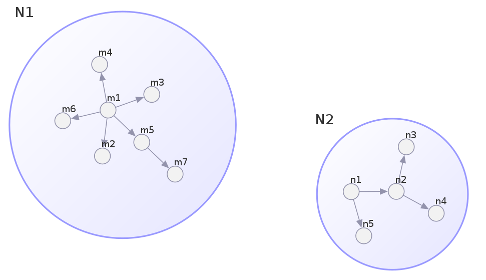

# Overview

*RedeR* is an R-based package combined with a Java application for network analysis and visualization. *RedeR* is designed to deal with three key challenges in network analysis. Firstly, biological networks are modular and hierarchical, so network visualization needs to take advantage of such structural features. Secondly, network analysis relies on statistical methods, many of which are already available in resources like _CRAN_ or _Bioconductor_. Thirdly, in larger networks user input is needed to focus the view of the network on the biologically relevant parts, rather than relying on an automatic layout function. The graphical user interface is depicted in **Figure \@ref(fig:fig1)**.

```{r fig1, echo=FALSE, fig.cap="RedeR's graphical user interface. The startRedeR() function initializes the R-to-Java interface. RedeR ($\\geq$ 3) will need the Java Runtime Environment (JRE) version 11 (Java $\\geq$ 11). In order to check the Java on your system, see the System Requirements section.", out.width = '80%'}

```

# Quick start

```{r label='Load packages', eval=TRUE, message=FALSE}
#--- Load required packages
library("RedeR")
library("igraph")
``` 

## Initializing the interface

The RedeR/R package sets all details to initialize the R-to-Java interface. Next, the `startRedeR()` function will launch the *RedeR* application (**Figure \@ref(fig:fig1)**), initializing the R-to-Java interface:

```{r label='Initialize the R-to-Java interface', eval=FALSE}
#--- Initialize the R-to-Java interface
startRedeR()
``` 

Note that RedeR >=2.0.0 is designed to run on Java>=11 (see [system requirements](#system-requirements)).

## Displaying graphs

The `addGraphToRedeR()` function displays *igraph* objects in the *RedeR* application. The following snippet will display the `gtoy1` graph in *RedeR*, using the `layout_with_kk()` function to set the network layout (**Figure \@ref(fig:fig2)**):

```{r label='Add a graph', eval=TRUE}
#--- Add a graph
gtoy1 <- graph.lattice(c(3,3,3))
addGraphToRedeR(g=gtoy1, layout=layout_with_kk(gtoy1))
``` 

```{r fig2, echo=FALSE, fig.cap="A toy example generated by the *addGraphToRedeR()* function.", out.width = '40%'}
knitr::include_graphics("fig2.png")
```

<br class="small">

In the reverse process, graphs are transferred from the application to _R_ using the `getGraphFromRedeR()` function:

```{r label='Get a graph', eval=TRUE}
#--- Get a graph
gtoy2 <- getGraphFromRedeR()
summary(gtoy2)
# IGRAPH fc08ebf UN-- 27 54 -- 
# + attr: zoom (g/n), name (v/c), x (v/n), y (v/n)
#...
``` 

```{r label='Reset application (1)', eval=TRUE}
#--- Reset the application:
resetRedeR()
``` 


## Working with containers

The `addGraphToRedeR()` method is also used to nest graphs into containers when setting `isNested = TRUE`. Next, the graphs `g1` and `g2` are nested into containers and then displayed in the *RedeR* application.

```{r label='Generate two scale-free graphs', eval=TRUE}
#--- Generate two scale-free graphs
g1 <- sample_pa(7)
g2 <- sample_pa(5)

#--- Set names to graph vertices
V(g1)$name <- paste("m",1:7,sep="")
V(g2)$name <- paste("n",1:5,sep="")

#--- Nest graphs into containers
addGraphToRedeR(g=g1, isNested=TRUE, gcoord=c(30,30), gscale=50)
addGraphToRedeR(g=g2, isNested=TRUE, gcoord=c(70,70), gscale=40)
``` 

```{r fig3, echo=FALSE, fig.cap="Nested graphs in *RedeR* using the *addGraphToRedeR()* function.", out.width = '70%'}

```

<br class="small">

In this case, `g1` and `g2` are nested into containers *N1* and *N2*, respectively (**Figure \@ref(fig:fig3)**). Each subgraph will retain the network structure, allowing access to individual nodes and edges in subsequent jobs. For example, the following snippet selects all nodes in container *N2* and then retrieves the corresponding subgraph.

```{r label='Select nodes in containers', eval=TRUE}
#--- Select nodes within a container 
selectNodes(nodes="N2")

#--- Get nodes from 'N2'
getGraphFromRedeR(status="selected")
``` 

```{r label='Reset application (2)', eval=TRUE}
#--- Reset the application:
resetRedeR()
``` 


## Interactive layout

The following snippet generates a scale-free graph using igraph's `sample_pa()` function and then displays the network in *RedeR*.

```{r label='Generate a larger scale-free graph', eval=TRUE}
#--- Generate a larger scale-free graph
g1 <- sample_pa(100, directed=FALSE)

#--- Set names to igraph vertices
V(g1)$name <- paste0("V",1:vcount(g1))

#--- Check attributes in the 'g1' graph
summary(g1)
``` 

```{r label='Send the g1 graph to RedeR', eval=FALSE}
#--- Send the 'g1' graph to RedeR
addGraphToRedeR(g=g1, zoom=50)
``` 

Next, the `relaxRedeR()` function starts *RedeR*'s interactive force-directed layout algorithm, which will arrange the network as in **Figure \@ref(fig:fig4)A**. The layout algorithm has 9 parameters (`p1` to `p9`), set either in the `relaxRedeR()` function or in the interactive application. These parameters control the layout algorithm by adjusting the relaxing process to the hierarchical levels of the network.

```{r label='Run the interactive layout', eval=FALSE}
#--- Run RedeR's interactive layout
relaxRedeR(p1=20, p2=150, p3=20, p4=100, p5=10)
``` 

```{r fig4, echo=FALSE, fig.cap="Graph layouts set by *RedeR*'s interactive force-directed algorithm. A) Section of a scale-free graph generated by igraph's *sample_pa()* function. B) Section a demo network available in the *RedeR* application.", out.width = '75%'}

```

```{r label='Reset application (3)', eval=TRUE}
#--- Reset the application:
resetRedeR()
``` 

<br class="small">

# Command-line attributes

*RedeR* attributes can be set either using the graphical user interface or the command-line interface. When using command-line attributes, these must follow `r BiocStyle::CRANpkg("igraph")` syntax rules and valid *RedeR*'s attribute names. Graph attributes are set directly on a graph using *igraph* shortcuts, while node and edge attributes are set using *igraph*'s `V()` and `E()` functions, respectivelly. For example:

```{r label='Set new attributes', eval=TRUE}
#--- Set a new graph attribute in 'g1'
g1$bgcolor <- "white"

#--- Set new node attributes in 'g1'
V(g1)$nodeLineColor <- "skyblue"
V(g1)$nodeSize <- 50

#--- Set new edge attributes in 'g1'
E(g1)$edgeLineColor <- "skyblue"
E(g1)$edgeLineWidth <- 10
``` 

```{r label='Check new attributes', eval=TRUE}
#--- Check the new attributes in 'g1'
summary(g1)
``` 

<br class="small">

Tables \@ref(tab:tab1), \@ref(tab:tab2), and \@ref(tab:tab3) list all command-line attributes available for the current version (`r BiocStyle::pkg_ver("RedeR")`), including usage examples.

<br class="small">

```{r table1, eval=TRUE, echo=FALSE}
rdp <- RedPort()
attribs <- attributes(rdp)
attribs$GraphAttr$Usage <- gsub("$","\\$",attribs$GraphAttr$Usage, fixed=TRUE)
colnames(attribs$GraphAttr)[1] <- "RedeR attribute"
colnames(attribs$GraphAttr)[4] <- "Usage example"
knitr::kable(attribs$GraphAttr, format="html", valign='t', linesep='', label="tab1", 
             table.attr = "style='width:100%;'",
             caption="**Graph attributes**. 
             Examples of how to set *RedeR*'s graph attributes using *igraph* shortcuts.")
``` 

<br class="small">

```{r table2, eval=TRUE, echo=FALSE}
rdp <- RedPort()
attribs <- attributes(rdp)
attribs$VertexAttr$Usage <- gsub("$","\\$",attribs$VertexAttr$Usage, fixed=TRUE)
colnames(attribs$VertexAttr)[1] <- "RedeR attribute"
colnames(attribs$VertexAttr)[4] <- "Usage example"
knitr::kable(attribs$VertexAttr, format="html", valign = 't',linesep='', label="tab2", 
             table.attr = "style='width:100%;'",
             caption="**Node attributes**. 
             Examples of how to set *RedeR*'s node attributes using *igraph* shortcuts.")
``` 

<br class="small">

```{r table3, eval=TRUE, echo=FALSE}
rdp <- RedPort()
attribs <- attributes(rdp)
attribs$EdgeAttr$Usage <- gsub("$","\\$",attribs$EdgeAttr$Usage, fixed=TRUE)
colnames(attribs$EdgeAttr)[1] <- "RedeR attribute"
colnames(attribs$EdgeAttr)[4] <- "Usage example"
knitr::kable(attribs$EdgeAttr, format="html", valign = 't',linesep='', label="tab3", 
             table.attr = "style='width:100%;'",
             caption="**Edge attributes**. 
             Examples of how to set *RedeR*'s edge attributes using *igraph* shortcuts.")
``` 

<br>

*RedeR* provides two wrapper functions to add fixed values to *igraph* graphs. The `att.addv()` function adds a new attribute with a fixed value to all nodes or selected nodes, while `att.adde()` function adds a new attribute with a fixed value to all edges. These functions will require that the vertices are named.

```{r label='Make sure vertices are named', eval=TRUE}
#--- Make sure vertices are named!
V(g1)$name[1:5]
```

```{r label='Using att.addv and att.adde wrapper functions', eval=TRUE}
#--- Add 'nodeLabelSize' attribute from a fixed value
g1 <- att.addv(g1, to = "nodeLabelSize", value = 20)

#--- Same as above, but applied only to three nodes
g1 <- att.addv(g1, to = "nodeLabelSize", value = 70, 
  filter = list("name" = V(g1)$name[1:3]))

#--- Add 'edgeLineType' attribute from a fixed value
g1 <- att.adde(g1, to = "edgeLineType", value = "DOTTED")
```

```{r label='Check new attributes ', eval=TRUE}
#--- Check the new attributes added to 'g1'
summary(g1)
``` 

<br>

Alternatively, *RedeR*'s attributes can be set using the `att.mapv()`, `att.setv()`, and `att.sete()` wrapper functions. The `att.mapv()` will map variables from a data frame to *igraph* vertices, while the `att.setv()` and `att.sete()` will transform vertex and edge variables into valid attribute types. Next, to demonstrate these functions, we will create a `data.frame` object with compatible identifiers.

```{r label='Create data frame', eval=TRUE}
#--- Create data frame with IDs compatible to 'g1'
df <- data.frame(ID=sample(V(g1)$name))

#--- Add two random variables for demonstration
df$newAttr1 <- rnorm(nrow(df))
df$newAttr2 <- rnorm(nrow(df))
``` 

``` {r label='Using att.mapv wrapper function', eval=TRUE}
#--- Map 'df' to 'g1' using the att.mapv() function
#Note: 'refcol' indicates a 'df' column for mapping IDs
g1 <- att.mapv(g=g1, dat=df, refcol=1)

#--- Check the new attributes mapped to 'g2'
summary(g1)
``` 

Note that new names were included in the `g2` graph, but these names are not valid *RedeR*'s attributes yet. Next, the `att.setv()` and `att.sete()` functions are used to transform different data types into valid attributes.

```{r label='Using att.setv and att.sete wrapper functions', eval=TRUE}
# Set 'nodeColor' from 'newAttr1'
g1 <- att.setv(g1, from="newAttr1", to="nodeColor", 
  breaks=seq(-2,2,0.4), pal=2)

# Set 'nodeSize' from 'newAttr1'
g1 <- att.setv(g1, from="newAttr2", to="nodeSize", 
  nquant=10, xlim=c(20,50,1))

#--- Check the new attributes set in 'g1'
summary(g1)
```


# Workflow examples

This section provides some practical examples of how users might integrate its own pre-processed data into a graph visualization workflow. Please refer to [Castro et al. (2016)](https://doi.org/10.1186/gb-2012-13-4-r29) and [Cardoso et al. (2021)](https://doi.org/10.1093/bioinformatics/btab819) for more details about the biological background and experimental design of each example.

## Nested subgraphs

Start the *RedeR* application (*i.e.* run the `startRedeR()` function), and then load the `ER.limma` and `hs.inter` datasets. The `ER.limma` is a data frame with results from a time-course differential expression analysis, listing differentially expressed (DE) genes from estrogen-treated MCF-7 cells for 0, 3, 6, and 12 hours (contrasts: t3-t0, t6-t0, and t12-t0). The `hs.inter` is an *igraph* graph derived from the Human Protein Reference Database (HPRD, release 9; https://www.hprd.org/). The next snippets list a step-by-step preparation of three nested subgraphs to display in the *RedeR* application.

```{r label='Workflow 1: Load required packages', eval=TRUE, message=FALSE}
#--- Load required packages
library("RedeR")
library("igraph")
``` 

```{r label='Workflow 1: Initialize the RedeR application', eval=TRUE}
#--- If not running, initialize the ReadeR application
# startRedeR()
resetRedeR()
``` 

```{r label='Workflow 1: Load a dataframe and an interactome', eval=TRUE}
#--- Load a dataframe and an interactome
data(ER.limma)
data(hs.inter)
``` 

Extract a subgraph from the `hs.inter` graph and set its attributes using the `att.setv()` function. This subgraph will include DE genes called in the t3-t0 contrast. Note that some genes are not listed in the `hs.inter`, and that's okay.

```{r label='Workflow 1: Extract a subgraph and set attributes', eval=TRUE}
#-- Extract a subgraph from the hs.inter graph
deg.t3 <- ER.limma[ER.limma$degenes.t3!=0,]
gt3  <- subg(g=hs.inter, dat=deg.t3, refcol=1)
#-- Set attributes
gt3  <- att.setv(g=gt3, from="Symbol", to="nodeLabel")
gt3  <- att.setv(g=gt3, from="logFC.t3", to="nodeColor", 
  breaks=seq(-2,2,0.4), pal=2)
``` 

Extract another subgraph from the `hs.inter` graph, for DE genes in the t6-t0 contrast:

```{r label='Workflow 1: Extract another subgraph and set attributes', eval=TRUE}
#--- Extract another subgraph from the hs.inter graph
deg.t6 <- ER.limma[ER.limma$degenes.t6!=0,]
gt6  <- subg(g=hs.inter, dat=deg.t6, refcol=1)
#--- Set attributes
gt6  <- att.setv(g=gt6, from="Symbol", to="nodeLabel")
gt6  <- att.setv(g=gt6, from="logFC.t6", to="nodeColor",
  breaks=seq(-2,2,0.4), pal=2)
``` 

Extract another subgraph from the `hs.inter` graph, for DE genes in the t12-t0 contrast:

```{r label='=Workflow 1: Extract another subgraph and set attributes', eval=TRUE}
#--- Extract another subgraph from the hs.inter graph
deg.t12 <- ER.limma[ER.limma$degenes.t12!=0,]
gt12  <- subg(g=hs.inter, dat=deg.t12, refcol=1)
#--- Set attributes
gt12 <- att.setv(g=gt12, from="Symbol", to="nodeLabel")
gt12 <- att.setv(g=gt12, from="logFC.t12", to="nodeColor", 
  breaks=seq(-2,2,0.4), pal=2)
``` 

```{r label='=Workflow 1: Customize subgraph names', eval=TRUE}
#--- Customize subgraph names
gt3$nestLabel <- "3h"
gt6$nestLabel <- "6h"
gt12$nestLabel <- "12h"
``` 

Now use the `addGraphToRedeR()` function to send the three subgraphs to the *RedeR* application, nesting them into containers. This should start building the nested network depicted in **Figure \@ref(fig:fig5)**. The `addGraphToRedeR()` function will return the container IDs, from `N1` to `N5`, which will be used to identify the graph parents.

```{r label='Workflow 1: Send subgraphs to the RedeR application', eval=TRUE}
#--- Send nested subgraphs to the RedeR application
N1 <- addGraphToRedeR(gt3, gcoord=c(10,25), gscale=20, 
  isNested=TRUE, theme='th1', zoom=30)
N2 <- addGraphToRedeR(gt6, gcoord=c(20,70), gscale=50, 
  isNested=TRUE, theme='th1', zoom=30)
N3 <- addGraphToRedeR(gt12, gcoord=c(70,55), gscale=80, 
  isNested=TRUE, theme='th1', zoom=30)
``` 

... and use the `nestNodes()` function to nest overlapping genes in the time series:

```{r label='Workflow 1: Nest sub-subgraphs', eval=TRUE}
#--- Nest nodes into the sub-subgraphs
N4 <-nestNodes(nodes=V(gt3)$name, parent=N2, theme='th2')
N5 <- nestNodes(nodes=V(gt3)$name, parent=N3, theme='th2')
nestNodes(nodes=V(gt3)$name, parent=N5, theme='th2')
``` 

To simplify the graph, the `mergeOutEdges()` function can be used to assign edges to containers:

```{r label='Workflow 1: Assign edges to containers', eval=TRUE}
#--- Assign edges to containers
mergeOutEdges(nlevels=2)
``` 

...then telax the network:

```{r label='Workflow 1: Relax the network', eval=TRUE}
relaxRedeR(p1=100, p2=100, p3=5, p4=150, 
  p5=5, p8=10, p9=20)
``` 

...and add a color legend:

```{r label='Workflow 1: Add a color legend', eval=TRUE}
scl <- gt3$legNodeColor$scale
names(scl) <- gt3$legNodeColor$legend 
addLegendToRedeR(scl, type="nodecolor",
  title="Node color (logFC)",
  stretch = 0.1)
``` 

Next, the `selectNodes()` function will zoom-in on the *RET* gene at different time points:

```{r label='Workflow 1: Select a gene', eval=TRUE}
selectNodes("RET")
# repeat this line to see RET in all graph instances
``` 

```{r fig5, echo=FALSE, fig.cap="Nested subnetworks. This graph shows genes differentially expressed in estrogen-treated MCF-7 cells at 3, 6 and 12 h (relative to 0 h). The insets correspond to the overlap between consecutive time points. Adapted from Castro *et al.* (2012, https://doi.org/10.1186/gb-2012-13-4-r29).", out.width = '70%'}
knitr::include_graphics("fig5.png")
```

## *Tree-and-leaf* diagrams

The `r BiocStyle::Biocpkg("TreeAndLeaf")` package combines tree and force-directed layout algorithms for drawing binary trees, aiming to improve the visualization of dendrogram leaves. *RedeR* is used to display *tree-and-leaf* diagrams. Next we will transform an `hclust` object into a `tree-and-leaf` object, and then display **Figure \@ref(fig:fig6)** in the *RedeR* application. Please refer to the `r BiocStyle::Biocpkg("TreeAndLeaf")` package's documentation for additional details and examples.

```{r label='Workflow 3: Load TreeAndLeaf', eval=TRUE, message=FALSE}
#--- Load required packages
library("RedeR")
library("igraph")
library("TreeAndLeaf")
``` 

```{r label='Workflow 3: Initialize the RedeR application', eval=TRUE}
#--- If not running, initialize the ReadeR application
#startRedeR()
resetRedeR()
``` 

```{r label='Workflow 2: hierarchical clustering', eval=TRUE}
#-- Generate an 'hclust' object from the 'iris' dataset
hc_iris <- hclust(dist(iris[,-5]))
```

```{r label='Workflow 3: Create a tree-and-leaf object', eval=TRUE}
#-- Convert the 'hclust' object into a 'tree-and-leaf' object
tal <- treeAndLeaf(hc_iris)

#--- Map 'iris' variables to the tree-and-leaf graph
#Note: 'refcol = 0' indicates that 'iris' rownames will be used as mapping IDs
tal <- att.mapv(g = tal, dat = iris, refcol = 0)

#--- Set node attributes using the 'att.setv' wrapper function
cols <- c("#80b1d3","#fb8072","#8dd3c7")
tal <- att.setv(tal, from="Species", to="nodeColor", cols=cols)
tal <- att.setv(tal, from="Species", to="nodeLineColor", cols=cols)	
tal <- att.setv(tal, from="Petal.Width", to="nodeSize", nquant=6, xlim=c(5,50,1))

#--- Set other attributes using igraph shortcuts
V(tal)$nodeLabel <- ""
E(tal)$edgeLineColor <- "grey70"
``` 

```{r label='Workflow 3: Send the tal graph to RedeR', eval=TRUE}
#--- Send the tree-and-leaf graph to RedeR
addGraphToRedeR(tal, zoom=50)

#--- Suggestion: anchor inner nodes to adjust the final layout
selectNodes(V(tal)$name[!V(tal)$isLeaf], anchor=TRUE)

#--- Call 'relax' to fine-tune the leaf nodes
relaxRedeR(p1=10, p2=100, p3=5, p4=120, p5=1, p6=100)

#--- Add legends
addLegendToRedeR(tal, type="nodecolor", title="Species", stretch=0.2)
addLegendToRedeR(tal, type="nodesize", title="PetalWidth")
``` 

```{r fig6, echo=FALSE, fig.cap="A tree-and-leaf diagram. This graph is obtained by transforming an *hclust* object into a *tree-and-leaf* object.", out.width = '50%'}

```


# Citation

If you use *RedeR*, please cite:

* Castro MA, Wang X, Fletcher MN, Meyer KB, Markowetz F (2012). "RedeR: R/Bioconductor package for representing modular structures, nested networks and multiple levels of hierarchical associations." *Genome Biology*, 13(4), R29. [Doi:10.1186/gb-2012-13-4-r29](https://doi.org/10.1186/gb-2012-13-4-r29).


# Other useful links

* Cardoso MA, Rizzardi LEA, Kume LW, Groeneveld C, Trefflich S, Morais DAA, Dalmolin RJS, Ponder BAJ, Meyer KB, Castro MAA. "TreeAndLeaf: an R/Bioconductor package for graphs and trees with focus on the leaves." *Bioinformatics*, 38(5):1463-1464, 2022. https://bioconductor.org/packages/TreeAndLeaf/

* Csardi G and Nepusz T. "The Igraph Software Package for Complex Network Research." *InterJournal*, ComplexSystems:1695, 2006. https://igraph.org


# System requirements{#system-requirements}

`r BiocStyle::pkg_ver("RedeR")` will need the Java Runtime Environment (JRE) version 11 or higher (Java >=11). In order to check the Java on your system, please use the `RedPort()` function with `checkJava=TRUE`, for example:

```{r label='Check Java version', eval=FALSE}
RedPort(checkJava=TRUE)
# RedeR will need Java Runtime Environment (Java >=11)
# Checking Java version installed on this system...
# openjdk version "11.0.13" 2021-10-19
# OpenJDK Runtime Environment (build 11.0.13+8-Ubuntu-0ubuntu1.20.04)
# OpenJDK 64-Bit Server VM (build 11.0.13+8-Ubuntu-0ubuntu1.20.04, mixed mode, sharing)
``` 

The exact output will vary, but you need to make sure the system meets the minimum version requirement.

# Session information

```{r label='Session information', eval=TRUE, echo=FALSE}
sessionInfo()
```

